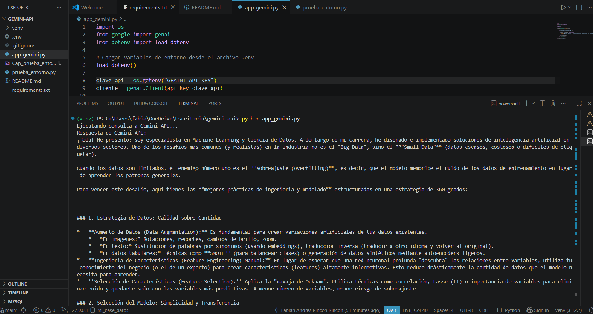
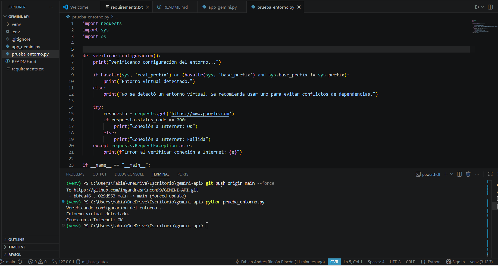

# 🤖 Proyecto Gemini API - Conexión con Python

Este proyecto permite conectarse a la API de Google Gemini utilizando Python para realizar consultas de inteligencia artificial enfocadas en Machine Learning.

---

## 📁 Estructura del proyecto

```
GEMINI-API/
│
├── app_gemini.py
├── app_gemini_v2.py
├── prueba_entorno.py
├── requirements.txt
├── .env
├── .gitignore
└── README.md
```

---

## ⚙️ Requisitos

- Python 3.10 o superior
- Cuenta y API Key de Google Gemini
- Entorno virtual (venv recomendado)

---

## 📦 Instalación

### 1. Clonar el repositorio

```bash
git clone https://github.com/ingandresrincon99/GEMINI-API.git
cd GEMINI-API
```

### 2. Crear entorno virtual

```bash
python -m venv venv
```

### 3. Activar entorno virtual

**Windows:**
```bash
venv\Scripts\activate
```

**Linux / Mac:**
```bash
source venv/bin/activate
```

### 4. Instalar dependencias

```bash
pip install -r requirements.txt
```

---

## 🔐 Configuración del archivo .env

Crear un archivo `.env` en la raíz del proyecto:

```
GEMINI_API_KEY=TU_API_KEY
```

---

## 🚀 Ejecución del proyecto

### Ejecutar consulta a Gemini

```bash
python app_gemini.py
```

### Verificar entorno

```bash
python prueba_entorno.py
```
## 📸 Imágenes del proyecto



